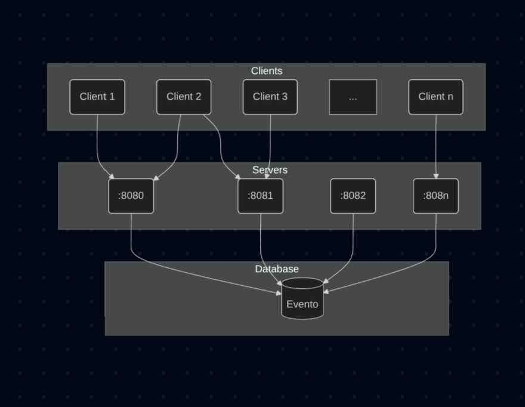
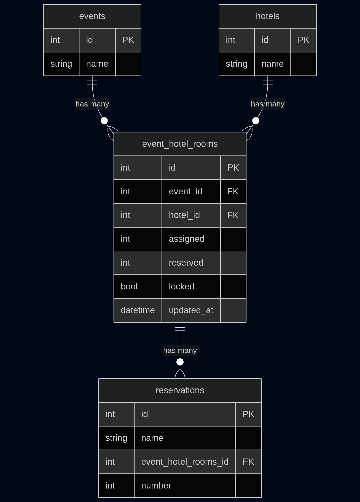

Evento is a proof of concept for a reservation system that handles concurrent reservation requests consistently. It consists of HTTP endpoints and is highly concurrent, connecting to a Postgres database.

### Objective
The objective of this POC is to validate that a concurrently consistent system is possible using Go and Postgres. As a side product, the repo demonstrates the means required to achieve such consistency and compare different strategies to achieve it.

#### Statements
- Evento hosts an event with a set of rooms available at different hotels
- Multiple clients could try to reserve rooms at the same time
- At any given time there might be more than one instance of Evento running
- There is only ONE instance of the database.
- Rooms are reserved concurrently
- Evento should NOT allow to reserve more than the rooms available

### The boxes
[](boxes.png)

#### The server
The server is a simple  HTTP server exposing two endpoints:
- `GET /{event_id}/available`: Returns the number of available rooms for a given event and hotel.
- `POST /{event_id}/{hotel_id}/reserve/{mode}`: Reserves a number of rooms for a given event and hotel.

#### The client
The client is a function trying to reserve a number of rooms for a given event and hotel. It will try to reserve rooms until it gets a response from the server saying there are no more rooms available.

- It calls /{event_id}/{hotel_id}/available to check how many rooms are available
- If there are rooms available, it calls /{event_id}/{hotel_id}/reserve/{mode} to try to reserve a number of rooms (1-5)
- It will then pause for a random amount of time (0-300ms)
- If the reservation is successful, it will repeat the process
- If the reservation fails because there are no more rooms available, it stops
- If the reservation fails because of a conflict, it retries

At any given time there might be more than one instance of the server running, simulating a distributed system.

#### The Database
At the database level we have a few tables that store the reservation data.

[](erd.png)

- events (id, name)
- hotels (id, name)
- event_hotel_rooms (id, event_id, hotel_id, assigned, reserved, locked, updated_at)
- reservations (id, name, event_hotel_rooms_id, number)


### Running the POC

Ensure you've cloned this repo and your current working directory is the root of it. To run Evento you need to have Go installed on your machine and a postgres database to use, either local or remote works.

Once you have the requirements, at the root folder run Evento using Go with:
```sh
> go run ./cmd/
```

You can specify the number of concurrent clients, servers, the mode to use and the number of rooms per hotel using command parameters:

```sh
> go run ./cmd/ --clients 200 --strategy naive --rooms 200 --servers 2
```

Where:
- `--clients 200` specifies the number of concurrent clients to simulate,
- `--mode naive` is the mode to use
- `--rooms 200` is the number of rooms per hotel
- `--servers 2` is the number of servers to run

The strategies available are:
- naive: No concurrency control at all
- pessimistic: Pessimistic locking using `SELECT ... FOR UPDATE`func
- atomic: Transactional approach without locking
- optimistic: Optimistic locking using `updated_at` timestamp

Database connection parameters can be set using `DATABASE_URL` environment variable. By default it will connect to `postgres://postgres@localhost:5432/evento`.
### Possible improvements / TODOs

- Locking rooms (part of the reservation)
- Better TUI, including progress.
